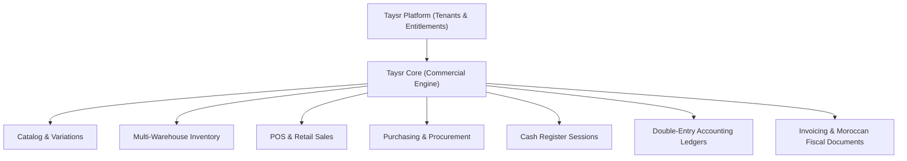

# Taysr Core v1 Blueprint (TaysrPOS_v1)

Taysr Core is the horizontal, vertical-neutral commercial engine of the Taysr platform. It provides enterprise-grade POS and ERP primitives for retail, wholesale, and services across French and Moroccan commerce ecosystems.

---

## 1. System Architecture

Taysr Core is designed as an API-first commercial backend paired with a high-density, touch-optimized web frontend:

- **Backend**: Node.js 22 / Express 5 / TypeScript 6 / Prisma ORM 7 / PostgreSQL 16
- **Frontend**: React 19 / Vite 8 / Tailwind-neutral Vanilla CSS design system / Lucide Icons
- **Tenancy**: Multi-tenant database model with dedicated company scopes and platform-level module entitlements
- **RBAC**: 4-tier hierarchical role system (`ADMIN`, `MANAGER`, `CASHIER`, `USER`) + fine-grained per-user action overrides (`UserPermission`)
- **Fiscal Compliance**: Moroccan ICE (15-digit), IF, RC, Patente, CNSS, and multi-rate TVA (20%, 14%, 10%, 7%, 0%)

---

## 2. Core Domain Primitives

### 1. Catalog & Product Master
- **Product Types**: `RETAIL` (stock-tracked physical goods), `SERVICE` (non-stock labor/services), `BUNDLE` (grouped items).
- **Tax Rates**: Dynamic snapshotted tax rates (`TaxRate`) with group tax support, ensuring historical immutability on finalized receipts.
- **Variations & Attributes**: Size, color, SKU, barcode, and per-variation purchase/selling price overrides (`ProductVariation`).
- **Pricing Groups & Discounts**: Customer group tiered pricing (`SellingPriceGroup`, `ProductGroupPrice`) and time-bounded promotional discounts (`Discount`).

### 2. Multi-Warehouse Inventory & Procurement
- **Warehouses**: Multi-location warehouse support with automated "Magasin principal" lazy initialization.
- **Atomic Stock Decrements**: Guaranteed non-negative stock validation during high-concurrency checkout.
- **Stock Movements**: Audited ledger for `IN` (purchases), `OUT` (sales), `TRANSFER` (inter-warehouse), `ADJUSTMENT` (inventory reconciliations), and `RETURN` (customer/supplier restock).
- **Purchasing**: Full PO lifecycle (`PENDING` $\rightarrow$ `PARTIALLY_RECEIVED` $\rightarrow$ `RECEIVED` $\rightarrow$ `RETURNED`) with automated accounts payable (AP) balance increments.

### 3. POS Checkout & Cash Management
- **High-Speed Terminal**: Touch-friendly product grid, barcode scanner integration, split payments (`CASH`, `CARD`, `BANK_TRANSFER`, `CHEQUE`, `CREDIT`), and suspended sale queue.
- **Cash Register Shift Lifecycle**: Opening float $\rightarrow$ In/out cash drawer movements $\rightarrow$ Counted closing drawer reconciliation $\rightarrow$ Automated Z-Report generation with variance analysis (`difference === 0 ? 'Juste' : 'Ecart'`).
- **Cash Ledger Auto-Posting**: Automatic debit/credit entries to the location's designated cash asset account upon register operations and cash sales.

### 4. Moroccan Fiscal Compliance & Invoicing
- **Fiscal Identity**: Company and customer tracking of 15-digit ICE, Identifiant Fiscal (IF), Registre du Commerce (RC), Taxe Professionnelle (Patente), and CNSS.
- **Consolidated Invoicing (*Facturation Groupée*)**: Aggregation of unbilled period sales into legal fiscal invoices (`ConsolidatedInvoice`) with mandatory ICE enforcement.
- **Unaccented Status Normalization**: System-wide adherence to standardized unaccented status labels: `Payee`, `Retour`, `Devis`, `Suspendue`, `Credit`, `Brouillon`.
- **Dynamic PDF Generation**: Direct server-side PDF generation for tickets, receipts, and fiscal invoices.

### 5. Multi-Currency Support
- **Base Ledger**: Authoritative ledger amounts are strictly denominated in company base currency (`MAD`).
- **FX Snapshot Immutability**: Foreign currency purchases and sales snapshot exchange rates at execution time, guaranteeing historical reporting immutability.

---

## 3. Role-Based Access Control (RBAC)

| Role | Scope & Permissions |
|---|---|
| **`ADMIN`** | Complete company ownership. Access to financial ledgers, settings, device management, locations, user permissions overrides, and report exports. |
| **`MANAGER`** | Store and operational supervisor. Permitted for product management, purchases, inventory transfers/adjustments, expenses, customer/supplier ledgers, and operational reports. Restricted from altering company settings or overriding user permissions. |
| **`CASHIER`** | Point of sale operator. Permitted for POS catalog lookup, creating sales, customer returns, opening/closing cash register sessions, and printing receipts. Forbidden from viewing accounting ledgers, purchasing, expenses, or settings. |
| **`USER`** | Read-only staff member. Permitted for basic product catalog and contact lookups. Forbidden from financial mutations. |

---

## 4. Architectural Boundaries: Core vs. Platform Verticals

Taysr Core is strictly vertical-neutral. Vertical business logic (e.g., Optical Lab, Restaurant, Pharmacy) lives outside of Core in dedicated applications and consumes Core via standardized REST API contracts:

| Domain Concern | Owner | Architecture Layer |
|---|---|---|
| Tenant Identity & Plans | **Taysr Platform** | Platform DB / API |
| Module Entitlements | **Taysr Platform** | Platform DB / API |
| Commercial Primitives (POS, Stock, Accounting) | **Taysr Core** | `TaysrPOS_v1` Core REST API |
| Optical Prescriptions, Lenses & Lab Orders | **Taysr Optic** | `TaysrOptic` Vertical Service |
| Kitchen Queue & Floor Tables | **Taysr Food** *(Future)* | Vertical Extension |

Core maintains zero knowledge of vertical-specific models or feature flags.
