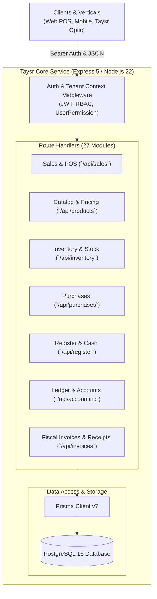

# Taysr Core Architecture Specification

Taysr Core (`TaysrPOS_v1`) is the foundation engine for commercial commerce across the Taysr ecosystem. It provides horizontal business capabilities to standalone retail/wholesale stores as well as specialized vertical applications (such as Taysr Optic).

---

## 1. Architectural Principles

1. **Vertical Neutrality**: Core has zero knowledge of optical prescriptions, restaurant tables, pharmacy DINs, or any vertical domain. It deals solely in generalized commercial primitives: Products, Inventory, Sales, Invoicing, Cash, and Accounting.
2. **API-First Service Boundary**: External services and vertical applications interact with Core via standard REST/JSON endpoints with Bearer token authentication. Direct database cross-imports from vertical applications are forbidden.
3. **Tenant & Context Isolation**: All database queries are filtered by `companyId` and `accountId`. Cross-tenant mutations yield strict `404 Not Found` or `403 Forbidden` responses.
4. **Historical Immutability**: All financial and tax transactions snapshot their effective TVA rates, unit costs, and FX rates at the moment of execution. Subsequent master catalog edits never retroactively rewrite past fiscal documents.
5. **Double-Entry Accounting Parity**: Every financial movement (POS cash checkout, purchase settlement, customer refund, register cash drop) maintains balanced debit/credit ledger records.

---

## 2. Component Architecture

---

## 3. Security Hardening & Hygiene Guarantees

- **No Plaintext Passwords**: Mandatory `bcrypt` hashing with salt rounds $\ge 10$ across all authentication and tenant provisioning paths.
- **Strict OAuth Flow**: Zero backdoor fallbacks or hardcoded hash bypasses.
- **Client Token Hygiene**: Decoded client JWT payloads contain only non-sensitive claims (`userId`, `username`, `companyId`, `role`, `accountId`, `platformUserId`). Internal database connection strings (`databaseUrl`) are strictly stripped.
- **Provisioning Secrets**: Tenant bootstrapping endpoints require cryptographic secret validation via `X-Platform-Secret`.
