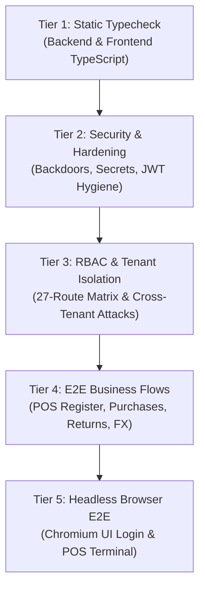

# TaysrPOS_v1 Testing Guide

This document defines the automated testing architecture, testing tiers, test execution commands, database isolation strategy, and CI/CD automation in **TaysrPOS_v1**.

---

## 1. Testing Philosophy & Guarantees

1. **Deterministic & Isolated Execution**: Every test runs against real PostgreSQL with a dynamically generated tenant fixture (`createTestTenant`). Zero state is shared across tests, and zero test records are orphaned after test completion (`cleanupTestTenant`).
2. **Zero Plaintext Credentials**: All test tenants and user accounts hash passwords with `bcrypt` (work factor 4 for test performance, 10 for production).
3. **Strict RBAC & Tenant Isolation Enforcement**: Every route is verified against all 4 user roles (`ADMIN`, `MANAGER`, `CASHIER`, `USER`), and cross-tenant access attempts are asserted to return `404 Not Found` or `403 Forbidden`.
4. **Moroccan Fiscal & Accounting Rigor**: TVA calculations, consolidated invoices (`facturation groupée`), ICE validation, and unaccented status labels (`Payee`, `Retour`, `Devis`, `Suspendue`, `Credit`) are asserted across all transactional workflows.

---

## 2. Five-Tier Testing Architecture



| Tier | Directory / Script | Coverage Scope | Test Count |
|---|---|---|---|
| **Tier 1** | `npm run typecheck` | TypeScript compilation without emit across backend and frontend | 0 errors |
| **Tier 2** | `backend/tests/security/` | OAuth backdoor elimination, tenant provisioning secrets, JWT payload hygiene | 13 tests |
| **Tier 3** | `backend/tests/integration/` | 27-route RBAC permissions matrix, cross-tenant attack isolation, Moroccan fiscal compliance | 58 tests |
| **Tier 4** | `backend/tests/flows/` | POS register shift lifecycle, Purchase & inventory receiving, Sales returns & credit notes, Multi-currency FX snapshot immutability | 4 flow suites |
| **Tier 5** | `frontend/tests/e2e/` | Headless Chromium browser UI form login, session token validation, Cashier POS terminal interface | 2 E2E suites |

---

## 3. Test Fixture Lifecycle & Helpers

### `backend/tests/helpers/test-db.ts`
Provides tenant provisioning and foreign-key-aware cleanup:

- `createTestTenant(suffix: string): Promise<TestTenantContext>`
  - Creates a dedicated company (`accountId: ACC-test-<timestamp>-<suffix>`).
  - Generates 4 distinct users (`ADMIN`, `MANAGER`, `CASHIER`, `USER`) with signed JWT tokens.
  - Seeds store location, main warehouse, test product with stock, customer contact, and supplier contact.
- `cleanupTestTenant(tenant: TestTenantContext): Promise<void>`
  - Deletes all created records in reverse foreign-key dependency order (transactions, payments, sales, purchases, stock, users, locations, company).

### `backend/tests/helpers/test-client.ts`
Typed HTTP request wrapper:
- Injects `Authorization: Bearer <token>` headers.
- Supports `client.get`, `client.post`, `client.put`, `client.delete`.
- Automatically parses JSON response bodies and returns `{ status, headers, body }`.

### `backend/tests/helpers/test-server.ts`
Dynamic test server lifecycle manager:
- Binds Express API to an ephemeral port (port 0) or respects `process.env.PORT`.
- Exports `getTestServer()` and `closeTestServer()`.

---

## 4. Running Tests

### Full Repository Verification (All 5 Tiers)
```bash
npm run test:full
```

### Backend Test Suites
```bash
# All backend tests
npm run test --workspace backend

# Security suite only
npm run test:security --workspace backend

# Integration & RBAC suite only
npm run test:api --workspace backend

# End-to-end business flows only
npm run test:flows --workspace backend
```

### Frontend Headless Browser E2E Tests
```bash
npm run test:e2e --workspace frontend
```

### Static Typechecking
```bash
npm run typecheck
```

---

## 5. Continuous Integration (CI)

Automated testing is configured in `.github/workflows/ci.yml`:
- Runs on every `push` and `pull_request` to `master` and `main`.
- Boots PostgreSQL 16 Alpine service container with automated health check.
- Executes `npm run test:full` covering all 5 verification tiers.
